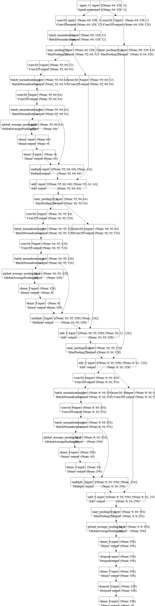

# Autonomous Vehicle
**Developed an Autonomous Vehicle using Webots, controlled by a Convolutional Neural Network (CNN)**

[Demo Video](https://youtu.be/mcM9Ateer5I?si=Ds7jcd3WmixGMfo3)

---

## Table of Contents
1. [Project Overview](#project-overview)
2. [Features](#features)
3. [System Architecture](#system-architecture)
4. [Getting Started](#getting-started)
   - [Prerequisites](#prerequisites)
   - [Installation](#installation)
   - [Dataset Preparation](#dataset-preparation)
   - [Model Training](#model-training)
   - [Running the Simulation](#running-the-simulation)
5. [Project Structure](#project-structure)
6. [Usage](#usage)
7. [Contributing](#contributing)
8. [License](#license)
9. [Acknowledgements](#acknowledgements)

---

## Project Overview
This project implements an autonomous vehicle simulation using [Webots](https://cyberbotics.com/), an open-source robotics simulator. The vehicle is controlled by a custom data trained Convolutional Neural Network (CNN) model that processes camera inputs from the simulated environment to generate driving commands (steering and throttle). 
The project demonstrates end-to-end autonomy, from perception to control, in a virtual environment.

---

## Features
- Realistic simulation of a mobile robot/vehicle in Webots.
- CNN-based attention model for interpreting the road environment and generating control signals.
- Modular and extensible architecture separating dataset, model and simulation components.
- Visualization of the CNN model architecture (see `model_architecture.png`).
- Extensible framework for adding new sensors, environments, or control strategies.

---

## System Architecture
The system consists of three main components:
1. **Dataset Module**: Captures image data from the vehicle driving in the Webots environment.
2. **Model Module**: Defines, trains, and validates the CNN model for autonomous driving control.
3. **Run Module**: Deploys the trained model in Webots for real-time autonomous control.

---


## Getting Started

### Prerequisites
- **Python**: Version 3.10 or higher
- **Webots**: Latest version (e.g., R2023b or newer)
- **TensorFlow**: Version 2.10.x
- **Additional Dependencies**: Listed in `requirements.txt`
- **Operating System**: Windows (instructions below; Linux/macOS support can be added if needed)
- **Git**: For cloning the repository
- **Visual Studio Code** (recommended for development)

### Installation

#### Cloning the Repository
```bash
git clone https://github.com/IshtishadAlamTishad/Autonomous-Vehicle.git
cd Autonomous-Vehicle
```

#### Windows Installation

1. **Install Webots**
   - Download the latest version of Webots (e.g., `webots-R2023b_setup.exe`) from the [official Webots website](https://cyberbotics.com/#download).
   - Double-click the installer and follow the on-screen instructions.
   - Refer to the [Webots documentation](https://cyberbotics.com/doc/guide/installation-procedure) for additional guidance.

2. **Install Python**
   - Download Python 3.10 or higher from [python.org](https://www.python.org/downloads/).
   - During installation, ensure you check **"Add Python to PATH"**.
   - Verify the installation by running:
     ```bash
     python --version
     ```

3. **Install Visual Studio Code** (optional, but recommended)
   - Download and install from [code.visualstudio.com](https://code.visualstudio.com/).

4. **Install Python Dependencies**
   - Navigate to the project directory in a terminal (e.g., Git Bash):
     ```bash
     cd ~/Autonomous-Vehicle
     pip install -r requirements.txt
     ```

5. **Set Up Environment Variables**
   - Press `Windows Key`, type "Edit the system environment variables," and open the System Properties window.
   - Click **Environment Variables** and add the following under **System Variables**:
     - **WEBOTS_HOME**: `C:\Program Files\Webots`
     - **PYTHONPATH**: `%WEBOTS_HOME%\lib\controller\python`
     - **PYTHONIOENCODING**: `UTF-8`
   - Add the following to the **Path** variable:
     - `%WEBOTS_HOME%\lib\controller`
     - `%WEBOTS_HOME%\msys64\mingw64\bin`
     - `%WEBOTS_HOME%\msys64\mingw64\bin\cpp`
   - Refer to the [Webots Python setup documentation](https://cyberbotics.com/doc/guide/running-extern-controllers#python-setup) for details.

### Dataset Preparation
1. Launch Webots and open the provided world file (e.g., `worlds/vehicleWorld.wbt`).
2. Use the dataset collection script (e.g., `scripts/createData.py`) to capture images and corresponding control commands (steering, throttle) from the simulation.
3. Save the dataset in the `dataset/` directory in a structured format (e.g., images and labels in CSV or HDF5).
4. [Add specific instructions for your dataset format or preprocessing steps, if applicable.]

### Model Training
1. Ensure the dataset is prepared and stored in the `dataset/` directory.
2. Run the training script to train the CNN model:
   ```bash
   python scripts/train_model.py
   ```
3. The trained model will be saved in the `models/` directory (e.g., `models/selfDrivingModelUpdatewithAttention.h5`).

### Running the Simulation
1. Open Webots and load the project from world file (e.g., `worlds/vehicleWorld.wbt`).
2. Run the simulation with the trained model:
   ```bash
   python scripts/run_simulation.py
   ```
3. The vehicle should navigate autonomously in the Webots environment using the CNN model.
4. [Add troubleshooting tips or specific runtime configurations, if needed.]

---

## Project Structure
```
Autonomous-Vehicle/
├── dataset/                 # Directory for storing collected dataset (image and JSON)
├── models/                  # Directory for trained CNN models
├── components/              
│   ├── createData.py         # codes for dataset creation (JSON)
│   ├── driveInputs.py       # codes for input and output controlling
│   ├── trainModel.py        # codes for running the vehicle with model in .wbt
│   └── utils.py             # codes for necessary vehicle modules
├── worlds/                  # Webots world files
│   └── vehicleWorld.wbt     # Simulation world
├── 
├── model_architecture.png   # CNN model architecture visualization image
├── requirements.txt         # dependencies
└── README.md                # Project documentation
```

---

## Usage
1. Follow the [Getting Started](#getting-started) section to set up the environment.
2. Collect a dataset using the provided script (`components/createData.py`).
3. Train the CNN model using `components/trainModel.py`.
4. Run the simulation with `runModel.py` to observe the autonomous vehicle in action.


---

Below is a high-level schematic of the CNN model:



---

## License
This project is licensed under the [MIT License](LICENSE). See the `LICENSE` file for details.

---

## Acknowledgements
- [Webots](https://cyberbotics.com/) for providing the simulation platform.
- [TensorFlow](https://www.tensorflow.org/) for the deep learning framework.
- [Iu Ayala](https://github.com/IuAyala) for learning the self driving car tutorial